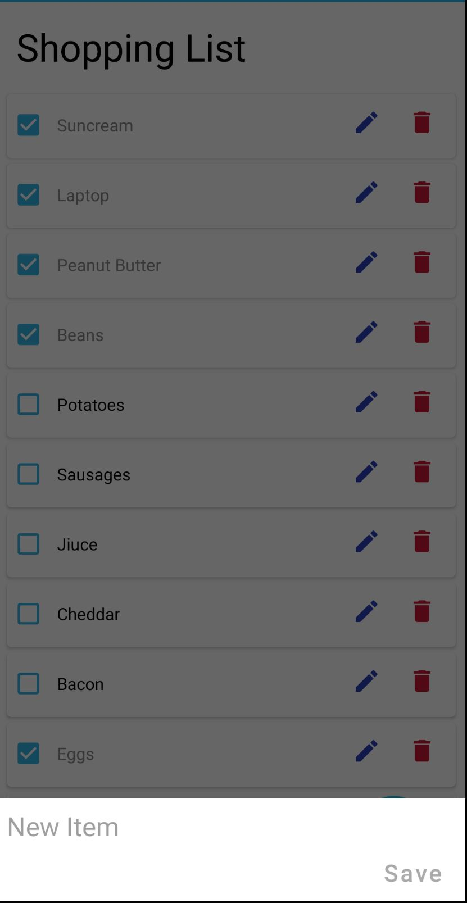
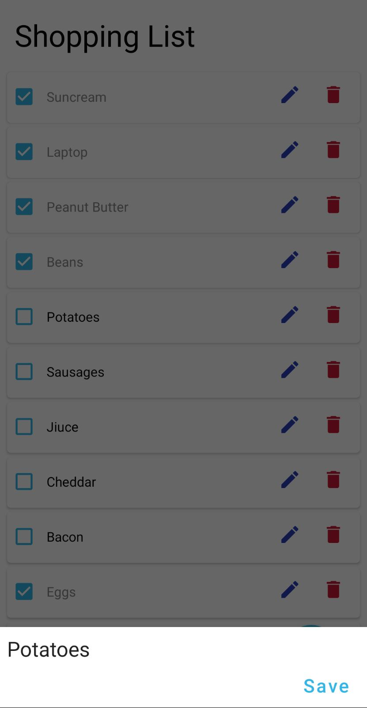
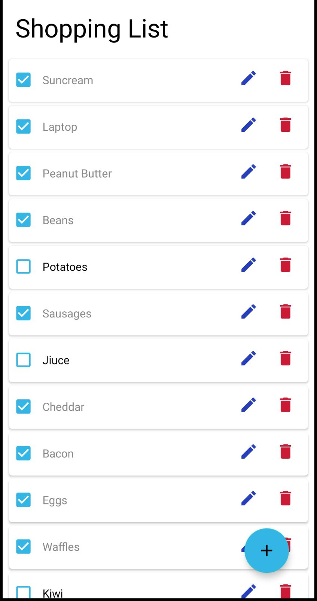
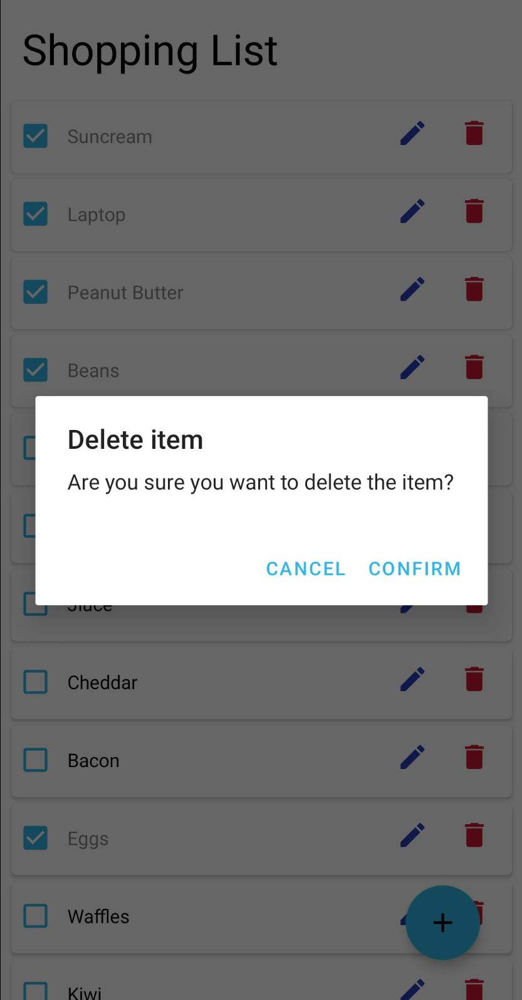

# My Shopping list app

This app is an android shopping list app created by Philip Wilkinson, adapating the code from the
[Penguin Codes ToDoList app tutorial](https://www.youtube.com/playlist?list=PLzEWSvaHx_Z2MeyGNQeUCEktmnJBp8136)
to function as a shopping list. This gives the suer the ability to add, edit and remove items
from their shopping list, along with checking whether items have been added to the basket
or not. The purpose of this was to create my own shopping list app, that I can use on
shopping trips, rather than having to rely on my partners phone.

# Features

The current application allows you to:

- Add a new item to the shopping list

- Edit the items on the shopping list

- Check that the item has been added to the basket

- Remove the item from the shopping list

# ToDo

While the app currently works there are still some changes that I hope to be able to implement
in the future as features or chanegs to the current application:

- Add an introduction to the application for new users on load to show how to use the app
- Add a button to delete all items that have been ticked as in the basket
- Moving all the checked items to the bottom of the list once an item is checked
- Adding the ability to create multiple shopping lists with titles
- The ability to create different types of lists (shopping list, to do list, birthday list) with
different functionalities 

